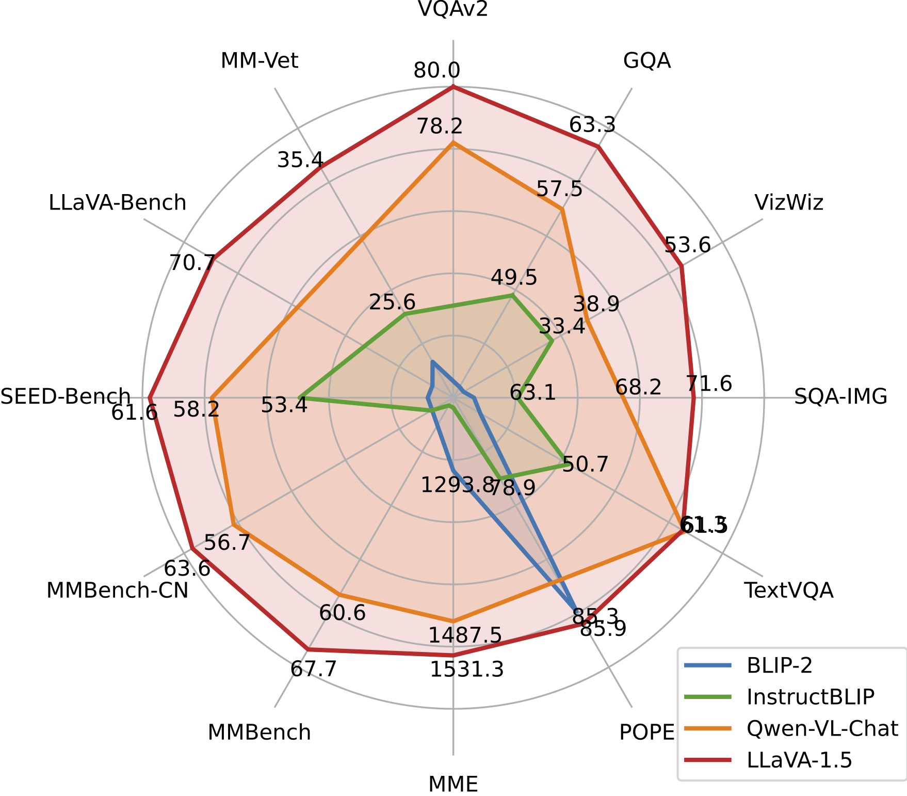

# Model Zoo

**To Use LLaVA-1.5 checkpoints, your llava package version must be newer than 1.1.0. [Instructions](https://github.com/haotian-liu/LLaVA#upgrade-to-latest-code-base) on how to upgrade.**

If you are interested in including any other details in Model Zoo, please open an issue :)

The model weights below are *merged* weights. You do not need to apply delta. The usage of LLaVA checkpoints should comply with the base LLM's model license: [Llama 2](https://github.com/facebookresearch/llama/blob/main/MODEL_CARD.md).

## LLaVA-v1.5

| Version | Size | Schedule | Checkpoint | VQAv2 | GQA | VizWiz | SQA | T-VQA | POPE | MME | MM-Bench | MM-Bench-CN | SEED | LLaVA-Bench-Wild | MM-Vet |
|----------|----------|-----------|-----------|---|---|---|---|---|---|---|---|---|---|---|---|
| LLaVA-1.5 | 7B | full_ft-1e | [liuhaotian/llava-v1.5-7b](https://huggingface.co/liuhaotian/llava-v1.5-7b) | 78.5 | 62.0 | 50.0 | 66.8 | 58.2 | 85.9 | 1510.7 | 64.3 | 58.3 | 58.6 | 65.4 | 31.1 |
| LLaVA-1.5 | 13B | full_ft-1e | [liuhaotian/llava-v1.5-13b](https://huggingface.co/liuhaotian/llava-v1.5-13b) | 80.0 | 63.3 | 53.6 | 71.6 | 61.3 | 85.9 | 1531.3 | 67.7 | 63.6 | 61.6 | 72.5 | 36.1 |
| LLaVA-1.5 | 7B | lora-1e | coming soon |
| LLaVA-1.5 | 13B | lora-1e | coming soon |

<p align="center">
   <br>
  LLaVA-1.5 achieves SoTA performance across 11 benchmarks.
</p>


## LLaVA-v1

*Note: We recommend using the most capable LLaVA-v1.5 series above for the best performance.*

| Base LLM | Vision Encoder | Pretrain Data | Pretraining schedule | Finetuning Data | Finetuning schedule | LLaVA-Bench-Conv | LLaVA-Bench-Detail | LLaVA-Bench-Complex | LLaVA-Bench-Overall | Download |
|----------|----------------|---------------|----------------------|-----------------|--------------------|------------------|--------------------|---------------------|---------------------|---------------------|
| Vicuna-13B-v1.3 | CLIP-L-336px | LCS-558K | 1e | LLaVA-Instruct-80K | proj-1e, lora-1e | 64.3 | 55.9 | 81.7 | 70.1 | [LoRA](https://huggingface.co/liuhaotian/llava-v1-0719-336px-lora-vicuna-13b-v1.3) [LoRA-Merged](https://huggingface.co/liuhaotian/llava-v1-0719-336px-lora-merge-vicuna-13b-v1.3) |
| LLaMA-2-13B-Chat | CLIP-L | LCS-558K | 1e | LLaVA-Instruct-80K | full_ft-1e | 56.7 | 58.6 | 80.0 | 67.9 | [ckpt](https://huggingface.co/liuhaotian/llava-llama-2-13b-chat-lightning-preview) |
| LLaMA-2-7B-Chat | CLIP-L | LCS-558K | 1e | LLaVA-Instruct-80K | lora-1e | 51.2 | 58.9 | 71.6 | 62.8 | [LoRA](https://huggingface.co/liuhaotian/llava-llama-2-7b-chat-lightning-lora-preview) |


## Projector weights

These are projector weights we have pretrained. You can use these projector weights for visual instruction tuning. They are just pretrained on image-text pairs, and are **NOT** instruction tuned, which means they do **NOT** follow instructions as good as our official models, and can output repetitive, lengthy, and garbled outputs. If you want to have nice conversations with LLaVA, use the checkpoints above (LLaVA v1.5).

**NOTE**: These projector weights are only compatible with the `llava>=1.0.0`, please check out the latest code base if your local code version is below `v1.0.0`.

**NOTE**: When you use our pretrained projector for visual instruction tuning, it is very important to **use the same base LLM and vision encoder** as the one we used for pretraining the projector. Otherwise, the performance will be very bad.

When using these projector weights to instruction tune your LMM, please make sure that these options are correctly set as follows,

```Shell
--mm_use_im_start_end False
--mm_use_im_patch_token False
```

| Base LLM | Vision Encoder | Projection | Pretrain Data | Pretraining schedule | Download |
|----------|----------------|---------------|----------------------|----------|----------|
| Vicuna-13B-v1.5 | CLIP-L-336px | MLP-2x | LCS-558K | 1e | [projector](https://huggingface.co/liuhaotian/llava-v1.5-mlp2x-336px-pretrain-vicuna-13b-v1.5) |
| Vicuna-7B-v1.5 | CLIP-L-336px | MLP-2x | LCS-558K | 1e | [projector](https://huggingface.co/liuhaotian/llava-v1.5-mlp2x-336px-pretrain-vicuna-7b-v1.5) |
| LLaMA-2-13B-Chat | CLIP-L-336px | Linear | LCS-558K | 1e | [projector](https://huggingface.co/liuhaotian/llava-336px-pretrain-llama-2-13b-chat) |
| LLaMA-2-7B-Chat | CLIP-L-336px | Linear | LCS-558K | 1e | [projector](https://huggingface.co/liuhaotian/llava-336px-pretrain-llama-2-7b-chat) |
| LLaMA-2-13B-Chat | CLIP-L | Linear | LCS-558K | 1e | [projector](https://huggingface.co/liuhaotian/llava-pretrain-llama-2-13b-chat) |
| LLaMA-2-7B-Chat | CLIP-L | Linear | LCS-558K | 1e | [projector](https://huggingface.co/liuhaotian/llava-pretrain-llama-2-7b-chat) |
| Vicuna-13B-v1.3 | CLIP-L-336px | Linear | LCS-558K | 1e | [projector](https://huggingface.co/liuhaotian/llava-336px-pretrain-vicuna-13b-v1.3) |
| Vicuna-7B-v1.3 | CLIP-L-336px | Linear | LCS-558K | 1e | [projector](https://huggingface.co/liuhaotian/llava-336px-pretrain-vicuna-7b-v1.3) |
| Vicuna-13B-v1.3 | CLIP-L | Linear | LCS-558K | 1e | [projector](https://huggingface.co/liuhaotian/llava-pretrain-vicuna-13b-v1.3) |
| Vicuna-7B-v1.3 | CLIP-L | Linear | LCS-558K | 1e | [projector](https://huggingface.co/liuhaotian/llava-pretrain-vicuna-7b-v1.3) |


## Science QA Checkpoints

| Base LLM | Vision Encoder | Pretrain Data | Pretraining schedule | Finetuning Data | Finetuning schedule | Download |
|----------|----------------|---------------|----------------------|-----------------|--------------------|---------------------|
| Vicuna-13B-v1.3 | CLIP-L | LCS-558K | 1e | ScienceQA | full_ft-12e | [ckpt](https://huggingface.co/liuhaotian/llava-lcs558k-scienceqa-vicuna-13b-v1.3) |


## Legacy Models (merged weights)

The model weights below are *merged* weights. You do not need to apply delta. The usage of LLaVA checkpoints should comply with the base LLM's model license.

| Base LLM | Vision Encoder | Pretrain Data | Pretraining schedule | Finetuning Data | Finetuning schedule | Download |
|----------|----------------|---------------|----------------------|-----------------|--------------------|------------------|
| MPT-7B-Chat | CLIP-L | LCS-558K | 1e | LLaVA-Instruct-80K | full_ft-1e | [preview](https://huggingface.co/liuhaotian/LLaVA-Lightning-MPT-7B-preview) |


## Legacy Models (delta weights)

The model weights below are *delta* weights. The usage of LLaVA checkpoints should comply with the base LLM's model license: [LLaMA](https://github.com/facebookresearch/llama/blob/main/MODEL_CARD.md).

You can add our delta to the original LLaMA weights to obtain the LLaVA weights.

Instructions:

1. Get the original LLaMA weights in the huggingface format by following the instructions [here](https://huggingface.co/docs/transformers/main/model_doc/llama).
2. Use the following scripts to get LLaVA weights by applying our delta. It will automatically download delta weights from our Hugging Face account. In the script below, we use the delta weights of [`liuhaotian/LLaVA-7b-delta-v0`](https://huggingface.co/liuhaotian/LLaVA-7b-delta-v0) as an example. It can be adapted for other delta weights by changing the `--delta` argument (and base/target accordingly).

```bash
python3 -m llava.model.apply_delta \
    --base /path/to/llama-7b \
    --target /output/path/to/LLaVA-7B-v0 \
    --delta liuhaotian/LLaVA-7b-delta-v0
```

| Base LLM | Vision Encoder | Pretrain Data | Pretraining schedule | Finetuning Data | Finetuning schedule | Download |
|----------|----------------|---------------|----------------------|-----------------|--------------------|------------------|
| Vicuna-13B-v1.1 | CLIP-L | CC-595K | 1e | LLaVA-Instruct-158K | full_ft-3e | [delta-weights](https://huggingface.co/liuhaotian/LLaVA-13b-delta-v1-1) |
| Vicuna-7B-v1.1 | CLIP-L | LCS-558K | 1e | LLaVA-Instruct-80K | full_ft-1e | [delta-weights](https://huggingface.co/liuhaotian/LLaVA-Lightning-7B-delta-v1-1) |
| Vicuna-13B-v0 | CLIP-L | CC-595K | 1e | LLaVA-Instruct-158K | full_ft-3e | [delta-weights](https://huggingface.co/liuhaotian/LLaVA-13b-delta-v0) |
| Vicuna-13B-v0 | CLIP-L | CC-595K | 1e | ScienceQA | full_ft-12e | [delta-weights](https://huggingface.co/liuhaotian/LLaVA-13b-delta-v0-science_qa) |
| Vicuna-7B-v0 | CLIP-L | CC-595K | 1e | LLaVA-Instruct-158K | full_ft-3e | [delta-weights](https://huggingface.co/liuhaotian/LLaVA-7b-delta-v0) |


## Legacy Projector weights

The following projector weights are deprecated, and the support for them may be removed in the future. They do not support zero-shot inference. Please use the projector weights in the [table above](#projector-weights) if possible.

**NOTE**: When you use our pretrained projector for visual instruction tuning, it is very important to **use the same base LLM and vision encoder** as the one we used for pretraining the projector. Otherwise, the performance will be very bad.

When using these projector weights to instruction tune your LMM, please make sure that these options are correctly set as follows,

```Shell
--mm_use_im_start_end True
--mm_use_im_patch_token False
```

| Base LLM | Vision Encoder | Pretrain Data | Pretraining schedule | Download |
|----------|----------------|---------------|----------------------|----------|
| Vicuna-7B-v1.1 | CLIP-L | LCS-558K | 1e | [projector](https://huggingface.co/liuhaotian/LLaVA-Pretrained-Projectors/blob/main/LLaVA-7b-pretrain-projector-v1-1-LCS-558K-blip_caption.bin) |
| Vicuna-13B-v0 | CLIP-L | CC-595K | 1e | [projector](https://huggingface.co/liuhaotian/LLaVA-Pretrained-Projectors/blob/main/LLaVA-13b-pretrain-projector-v0-CC3M-595K-original_caption.bin) |
| Vicuna-7B-v0 | CLIP-L | CC-595K | 1e | [projector](https://huggingface.co/liuhaotian/LLaVA-Pretrained-Projectors/blob/main/LLaVA-7b-pretrain-projector-v0-CC3M-595K-original_caption.bin) |

When using these projector weights to instruction tune your LMM, please make sure that these options are correctly set as follows,

```Shell
--mm_use_im_start_end False
--mm_use_im_patch_token False
```

| Base LLM | Vision Encoder | Pretrain Data | Pretraining schedule | Download |
|----------|----------------|---------------|----------------------|----------|
| Vicuna-13B-v0 | CLIP-L | CC-595K | 1e | [projector](https://huggingface.co/liuhaotian/LLaVA-Pretrained-Projectors/blob/main/LLaVA-13b-pretrain-projector-v0-CC3M-595K-original_caption-no_im_token.bin) |
